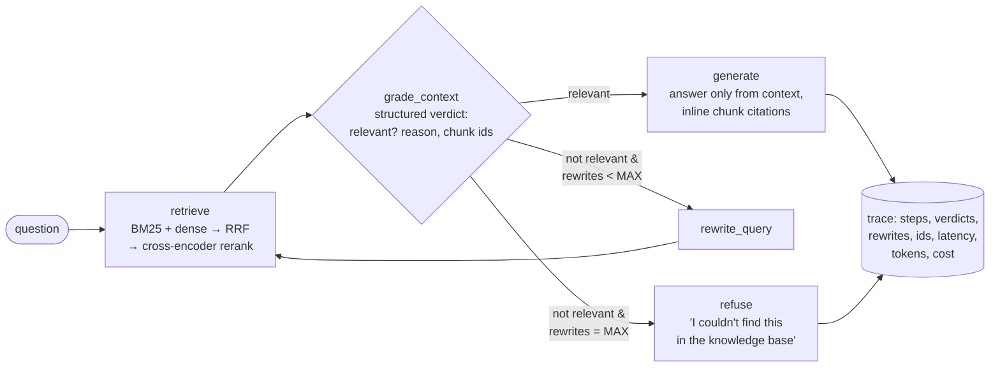

# Polygraph: Self-Reflective Agentic RAG with an Agent Evaluation Harness

**A LangGraph RAG agent that grades its own retrieval, rewrites failed queries and refuses rather than guessing, plus an evaluation harness that measures each of those decisions, not just the final answer.**

[](https://polygraph-an-evaluation-framework-for-agentic.streamlit.app/)
[](https://github.com/Swastigit2005/Polygraph-An-Evaluation-Framework-for-Agentic)


**Live demo:** https://polygraph-an-evaluation-framework-for-agentic.streamlit.app/

> Demo GIF: _placeholder._ To record one, open the live demo, ask an answerable question and one of the "not in the
> knowledge base" examples, expand **Agent trace**, then record with Kap (macOS, free) or ScreenToGif (Windows)
> and save it as `assets/demo.gif`.

The knowledge base is 242 pages of the Docker documentation (Engine, Compose, Build, Desktop), giving an
IT-support / DevOps assistant. Everything runs on free tiers: Groq for LLMs, local sentence-transformers for
embeddings and reranking, and Streamlit Community Cloud for hosting.

## Architecture



Every node writes a structured decision record. One run returns a `Trace`, and that trace is what the
evaluation scores and what the demo's **Agent trace** panel shows.

| Component | Choice |
|---|---|
| Orchestration | LangGraph `StateGraph` (`src/rag_agent/graph.py`) |
| Generator | `openai/gpt-oss-120b` on Groq |
| Grader and query rewriter | `openai/gpt-oss-20b` on Groq (small and fast) |
| Eval judge | `qwen/qwen3.8-27b` on Groq: a different model family from the generator, to reduce self-preference bias |
| Embeddings | `BAAI/bge-small-en-v1.5` (local, CPU) in ChromaDB |
| Lexical retrieval | `rank_bm25`, fused with dense results via Reciprocal Rank Fusion (k = 60) |
| Reranker | `cross-encoder/ms-marco-MiniLM-L-6-v2` (local, CPU) |
| Answer metrics | Ragas (faithfulness, answer relevancy) and DeepEval G-Eval (correctness), both routed through Groq |
| Tracing | Langfuse (optional; a no-op when its keys are absent) |

All behaviour is set by environment variables (`src/rag_agent/config.py`): `RETRIEVAL_MODE=dense|bm25|hybrid`,
`USE_RERANKER`, `USE_REFLECTION`, `MAX_REWRITES` and `TOP_K`. The ablations are just different settings of these.

## Evaluation results

<!-- RESULTS:START -->
Generated by `eval/make_report.py` from `eval/results/` (golden set: ai_reviewed; 70 items per config). Not yet run: `hybrid_rerank` (**TBD**).

| Metric | `baseline` | `hybrid` | `full` |
|---|---:|---:|---:|
| **Agent decisions** | | | |
| Grader precision (set) | — | — | 96.0% |
| Grader recall (set) | — | — | 98.0% |
| Grader precision (chunk) | — | — | 76.4% |
| Grader recall (chunk) | — | — | 90.2% |
| Correct-refusal rate (unanswerable) | 85.0% | 80.0% | 95.0% |
| False-refusal rate (answerable) | 8.0% | 2.0% | 2.0% |
| Rewrite success rate | — | — | 40.0% |
| Rewrites (answerable items) | 0 | 0 | 5 |
| Steps / query (mean) | 2.00 | 2.00 | 4.84 |
| Steps / query (p95) | 2.0 | 2.0 | 9.0 |
| Loop rate (hit MAX_REWRITES) | 0.0% | 0.0% | 30.0% |
| **Retrieval** | | | |
| Recall@k (first retrieval) | 77.2% | 81.7% | 86.7% |
| MRR@k (first retrieval) | 0.763 | 0.803 | 0.870 |
| **Ops** | | | |
| Latency p50 (s) | 0.91 | 0.93 | 3.55 |
| Latency p95 (s) | 1.99 | 1.58 | 54.76 |
| Tokens / query (mean) | 1,010 | 1,051 | 2,840 |
| Cost / query (USD, list price) | $0.00023 | $0.00023 | $0.00038 |
| Items evaluated | 70 | 70 | 70 |

— means not computed for that config (Ragas runs on `baseline` and `full` only; grader and rewrite metrics exist only when reflection is on). Full details, failure examples and traces: [`eval/results/ABLATIONS.md`](eval/results/ABLATIONS.md).
<!-- RESULTS:END -->

### What the metrics mean

**Agent decisions** (the core of the project):
- **Grader precision / recall (set level).** Each `grade_context` step is one prediction. Positive means the
  retrieved context contains at least one gold chunk. The chunk-level variant scores every graded chunk
  against `relevant_chunk_ids`.
- **Correct-refusal rate:** the share of unanswerable questions the agent refused.
- **False-refusal rate:** the share of answerable questions it refused.
- **Rewrite success rate:** the share of rewrites after which the grader passed and a gold chunk was retrieved.
- **Steps per query** (mean, p95) and **loop rate**, the share of queries that used all `MAX_REWRITES`.

**Retrieval:** Recall@k and MRR@k, computed on the first retrieval (the original question).

**Answers:**
- Ragas **faithfulness** (are the answer's claims supported by the retrieved context?).
- Ragas **answer relevancy**.
- DeepEval **G-Eval correctness** against the reference answer.
- **End-to-end accuracy:** correct answers divided by all answerable questions, so refusals count as wrong.

**Ops:** latency p50/p95 per query and per node, tokens per query, and cost per query at Groq list prices.
The free tier isn't billed. When a call is served from the disk cache, it's charged its originally measured
latency.

### Golden-set methodology

- **75–90 items drafted by an LLM** (`eval/draft_golden.py`) from seed chunks sampled across all four doc
  sections:
  - answerable questions, each with a grounded reference answer;
  - deliberately **vague** questions that need a rewrite;
  - **unanswerable** but plausible in-domain questions (Kubernetes administration, Swarm, Docker Hub billing,
    other CI systems).
- **Gold `relevant_chunk_ids`:** labelled by a different model (`qwen3.8-27b`) over a TREC-style pool, the top-5
  dense plus top-5 BM25 hits for each question. The grader being evaluated never labels its own gold.
- **Unanswerable checks:** each unanswerable item was checked against its retrieval pool, and dropped if any chunk
  answered it.
- **Review: done by an AI (Claude), not by a human.** Every item was read together with its gold and pooled
  chunks. Proposals are in `eval/ai_review_proposals.json`:
  - 70 kept: 40 answerable, 10 vague, 20 unanswerable;
  - 2 edited;
  - 17 rejected, mostly "unanswerable" questions the corpus partly answers, plus trivia and duplicates.
- **Which items count:** the metrics above use those 70 items (`--golden-source ai_reviewed`). A human can
  confirm or override every proposal with `eval/review_golden.py --proposals ...`; the runner then reports on
  `--golden-source verified` instead.
- **Judge calibration** (`eval/judge_calibration.py`) needs 30 human correct/incorrect labels to compute accuracy
  and Cohen's κ against the G-Eval judge. **It hasn't been done**, so the correctness numbers come from an
  uncalibrated LLM judge.

## Key design decisions and trade-offs

- **Refuse instead of falling back.** The original project generated "with the best context available" after
  three failed grades. Here, an explicit `refuse` node guarantees the generator never answers from bad context.
  The cost is false refusals when the grader is too strict, which the false-refusal rate measures directly.
- **Different models for grading, generating and judging.** A small, fast grader keeps the loop cheap. A
  different-family judge reduces self-preference bias.
- **Hybrid retrieval with RRF.** Docker questions are full of exact tokens (`daemon.json`, `--memory`, error
  strings) that BM25 matches well, and paraphrased symptoms that dense retrieval matches well. RRF combines the
  two without tuning score scales.
- **Structured grader output.** A Pydantic model through Groq structured outputs
  (`relevant`, `reason`, `relevant_chunk_ids`) replaces free-text parsing. The chunk ids make chunk-level grader
  metrics possible at no extra cost.
- **Designed for the free tier.**
  - Rate limiting per model (requests and tokens per minute).
  - Exponential backoff that honours `retry-after`.
  - Exhausted daily quotas are detected, and runs stop cleanly instead of retrying all day.
  - An SQLite response cache.
  - Resumable eval runs.
  - A per-day usage ledger (`scripts/usage_today.py`).
  - Ragas runs on a fixed 30-item subset, and only for `baseline` and `full`, to fit the judge's 200K-tokens/day
    budget.
- **Prebuilt index committed** (about 9 MB), so the demo starts instantly. Visitors don't have to upload anything.

## Failure analysis

`eval/results/ABLATIONS.md` lists up to five failure cases from the `full` config. Each has its trace and a
diagnosis: grader false negative, retrieval miss, generation error, grader false positive or rewrite loop. That
file is generated from the same results as the table above.

## Run locally

```bash
git clone https://github.com/Swastigit2005/Polygraph-An-Evaluation-Framework-for-Agentic && cd Polygraph-An-Evaluation-Framework-for-Agentic
uv venv -p 3.11 .venv && uv pip install -p .venv -r requirements.txt -r requirements-dev.txt -e .
cp .env.example .env                       # add GROQ_API_KEY (free at console.groq.com)
.venv/bin/python scripts/list_groq_models.py   # see which models your key can use; set them in .env
.venv/bin/streamlit run streamlit_app.py   # http://localhost:8501  (Gradio version: .venv/bin/python app.py)
.venv/bin/pytest -q                        # offline unit tests (no network)
```

Use `.venv/bin/python` explicitly if your shell aliases `python` to a system interpreter.

## Run the evaluations

```bash
.venv/bin/python eval/run_eval.py --config full --golden-source ai_reviewed --limit 5   # quick check
nohup .venv/bin/python eval/run_all.py > eval/results/run_all.log 2>&1 &                # all ablations
.venv/bin/python scripts/usage_today.py      # Groq free-tier usage today
.venv/bin/python eval/make_report.py         # rebuild ABLATIONS.md and this README's results section
```

A full ablation sweep (4 configs × 70 items, plus judges) needs more than one day of Groq free-tier quota.
`run_all.py` waits out the daily quota and resumes where it stopped.

CI (`.github/workflows/ci.yml`) runs ruff and the unit tests on every push. The **eval gate** runs on manual
dispatch, or on PRs labelled `run-evals`: it evaluates the `full` config on a fixed 20-item subset
(`eval/ci_subset.json`) and fails if any metric falls below `eval/thresholds.json`. The thresholds come from the
first full run, minus 0.10. The gate needs a `GROQ_API_KEY` repository secret.

## Deploy (Streamlit Community Cloud, free)

1. Push this repo to a public GitHub repository.
2. Run `.venv/bin/python scripts/make_streamlit_secrets.py`. It writes `.streamlit/secrets.toml` from your `.env`;
   the file is git-ignored.
3. On [share.streamlit.io](https://share.streamlit.io), sign in with GitHub and click **Create app → Deploy a
   public app from GitHub**:
   - repository: this repo, branch `main`, main file `streamlit_app.py`;
   - **Advanced settings → Python 3.11**, and paste the contents of `.streamlit/secrets.toml` into **Secrets**.
4. Deploy. The first build installs CPU-only PyTorch and downloads the two local models, taking a few minutes.

Alternatives: the Gradio app (`app.py`) runs on Hugging Face Spaces, which now requires a PRO plan for Gradio
Spaces, or anywhere Docker runs:
`docker build -t polygraph . && docker run -p 7860:7860 --env-file .env polygraph`.

## Limitations

- **The golden set was reviewed by an AI, not a human.** It's also small: 70 items, from one documentation
  corpus.
- **The correctness judge is uncalibrated.** No human labels have been collected.
- **Gold chunk labels come from pooling, so they can be incomplete.** Some "grader false positives" may actually
  be relevant chunks missing from the gold list.
- **Single run per config.** LLM outputs vary, so small differences between configs aren't significant.
- **The free-tier quota is shared with the live demo.** Under load, visitors see a "demo busy" message.
- **The corpus is a snapshot** (docker/docs@`6cf1b1c`, Oct 2026). Answers can go stale as Docker changes.

## Acknowledgements

- Base code: [Self-Reflective Agentic RAG](https://github.com/Sumanth077/Hands-On-AI-Engineering/tree/main/ai_agents/agentic_rag_system)
  from [Hands-On-AI-Engineering](https://github.com/Sumanth077/Hands-On-AI-Engineering) by Sumanth077 (MIT). See [NOTICE](NOTICE).
- Corpus: [Docker documentation](https://github.com/docker/docs) (Apache-2.0). See [data/corpus/SOURCES.md](data/corpus/SOURCES.md).
- Models: [BAAI/bge-small-en-v1.5](https://huggingface.co/BAAI/bge-small-en-v1.5),
  [cross-encoder/ms-marco-MiniLM-L-6-v2](https://huggingface.co/cross-encoder/ms-marco-MiniLM-L-6-v2),
  and gpt-oss and Qwen models served by [Groq](https://groq.com).

## License

This project's code is MIT-licensed ([LICENSE](LICENSE)). Corpus files keep their Apache-2.0 license.
